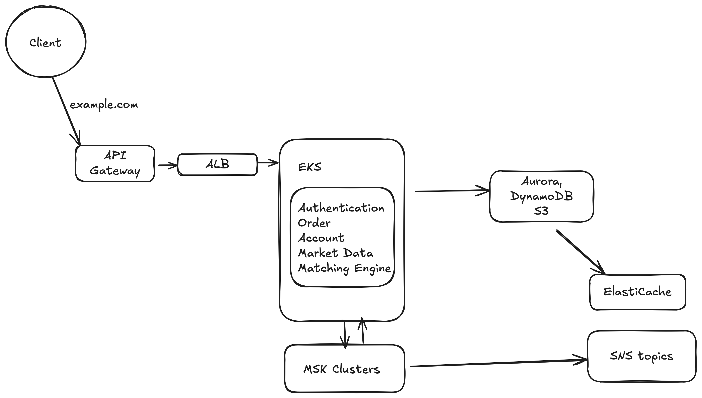

Provide your solution here:

# Components and Their Connections

## 1. Clients
- **Description**: Users interact with the system via web browsers, mobile apps, or API clients.
- **Connection**: Send REST API requests (e.g., placing orders) and establish WebSocket connections (e.g., for real-time market data) to the Amazon API Gateway.

## 2. Amazon API Gateway
- **Description**: Acts as the entry point for all client interactions.
- **Connections**:
  - Receives REST and WebSocket traffic from Clients.
  - Routes requests to the Application Load Balancer (ALB) for distribution to microservices.
  - Pushes real-time updates (e.g., market data) to clients via WebSocket connections.

## 3. Application Load Balancer (ALB)
- **Description**: Distributes incoming traffic across microservices for load balancing and high availability.
- **Connections**:
  - Receives traffic from API Gateway.
  - Forwards requests to the appropriate microservices running in Amazon EKS.

## 4. Amazon EKS (Elastic Kubernetes Service)
- **Description**: Hosts the core microservices in a Kubernetes cluster for scalability and resilience.
- **Microservices and Connections**:
  - **Authentication Service**:
    - Verifies user identity and authorizes requests.
    - Interacts with Aurora for user data.
  - **Order Service**:
    - Manages order placement, cancellation, and modification.
    - Publishes order events to the *orders* topic in Amazon MSK.
    - Stores order logs in DynamoDB.
  - **Account Service**:
    - Manages user balances, deposits, and withdrawals.
    - Subscribes to the *trades* topic in Amazon MSK to update balances asynchronously.
    - Updates Aurora with balance changes.
  - **Market Data Service**:
    - Disseminates real-time market data (e.g., price updates, order book changes).
    - Publishes to the *market-data* topic in Amazon MSK.
    - Caches data in ElastiCache (Redis).
  - **Matching Engine Service**:
    - Matches buy and sell orders for trading pairs.
    - Publishes trade execution events to the *trades* topic in Amazon MSK.
    - Uses ElastiCache (Redis) for low-latency order book access.

## 5. Databases
- **Description**: Provide persistent storage for various data types.
- **Components and Connections**:
  - **Amazon Aurora**:
    - Stores user data and account balances with ACID compliance.
    - Connected to Authentication and Account services.
  - **Amazon DynamoDB**:
    - Logs high-throughput data like trades and orders.
    - Connected to Order and Matching Engine services.
  - **Amazon S3**:
    - Archives historical market data for long-term storage.
    - Accessed by Market Data Service for historical queries.

## 6. Amazon ElastiCache (Redis)
- **Description**: In-memory caching layer for low-latency data access.
- **Connections**:
  - Caches order books, user sessions, and recent trades.
  - Used by Market Data and Matching Engine services.

## 7. Amazon MSK (Managed Streaming for Kafka)
- **Description**: Central event streaming platform for real-time data processing.
- **Topics and Connections**:
  - **market-data**:
    - Populated by Market Data Service.
    - Subscribed by clients (via WebSocket) and Analytics consumers.
  - **orders**:
    - Populated by Order Service.
    - Subscribed by Matching Engine and Analytics consumers.
  - **trades**:
    - Populated by Matching Engine.
    - Subscribed by Account Service, Analytics, Risk Management, and Notifications.

## 8. Consumers
- **Description**: Independent services processing streaming data from MSK.
- **Connections**:
  - **Analytics**: Subscribes to *market-data*, *orders*, and *trades* for insights.
  - **Risk Management**: Monitors anomalies and ensures compliance.
  - **Notifications**: Sends alerts based on events (e.g., large trades).

